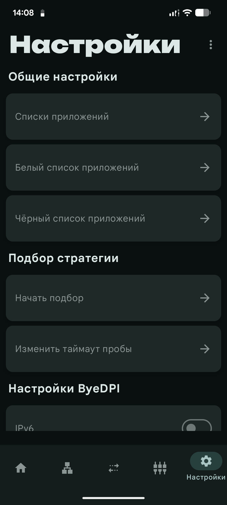

# zaprett
## О приложении
Приложение разработано для работы с модулем [zaprett](https://github.com/egor-white/zaprett)
> [!IMPORTANT]
> 📢 [Официальный Telegram-канал приложения](https://t.me/zaprett_module)

> [!CAUTION]
> ⚠️ Для корректной работы приложения **желательны root-права**, однако предусмотрен режим без root на основе **byedpi**

---

На данный момент приложение умеет:
* Запускать, останавливать и перезапускать сервис
* Работа с листами (добавление, включение и выключение, загрузка из репозитория)
* Работа с стратегиями (добавление, выбор, загрузка из репозитория)
* Авто обновление приложения

---

## [Репозиторий с хостами и стратегиями](https://github.com/CherretGit/zaprett-hosts-repo)

---

#### Данное приложение является ремейком [приложения](https://github.com/egor-white/zaprett-app) от [egor-white](https://github.com/egor-white), разработка которого была прекращена в пользу этого приложения

---

## Скриншоты:

  
  
   
  
  
   
  

