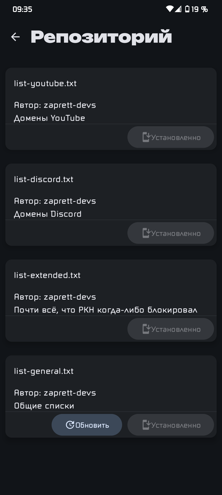

# zaprett
## О приложении
Приложение разработано для работы с модулем [zaprett](https://github.com/egor-white/zaprett)
### [Официальный Telegram-канал приложения](https://t.me/zaprett_module)
## ВНИМАНИЕ приложению желательно наличие root прав на устройстве, но есть режим работы без них на основе byedpi
На данный момент приложение умеет:
* Запускать, останавливать и перезапускать сервис
* Работа с листами (добавление, включение и выключение, загрузка из репозитория)
* Работа с стратегиями (добавление, выбор, загрузка из репозитория)
* Авто обновление приложения

## [Репозиторий с хостами и стратегиями](https://github.com/CherretGit/zaprett-hosts-repo)

#### Данное приложение является ремейком [приложения](https://github.com/egor-white/zaprett-app) от [egor-white](https://github.com/egor-white), разработка которого была прекращена в пользу этого приложения

## Скриншоты:

